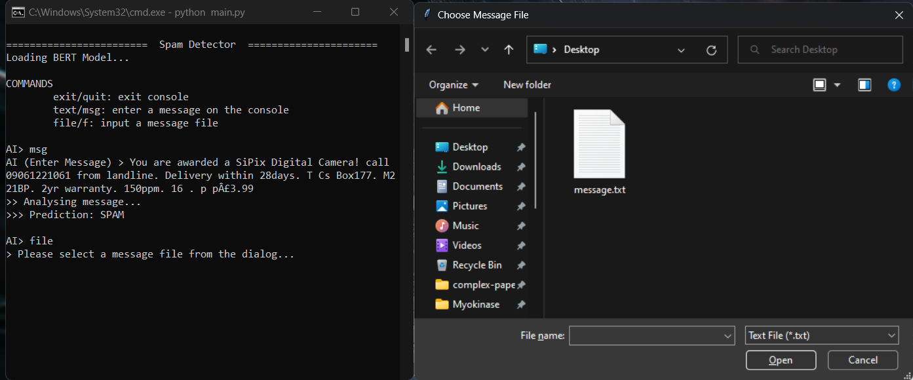
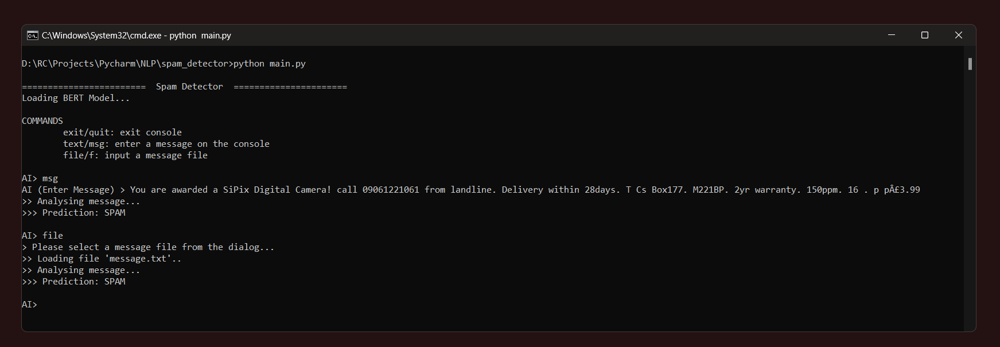
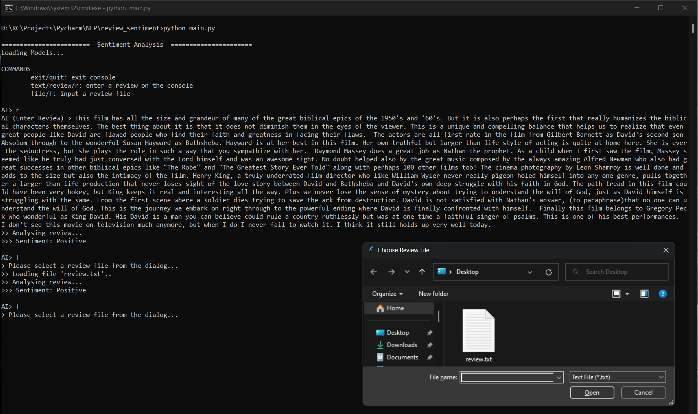

# Natural Language Processing (NLP)

#### Large scale NLP Sentiment Analysis and Spam Detection 

###### See also
[Digit Recognizer-AI](https://github.com/ChauhanRohan-RC/DigitRecognizer-AI.git)  
[Optical Character Recognizer-AI](https://github.com/ChauhanRohan-RC/OCR-AI.git)  
[Ping-Pong Online Multiplayer-AI](https://github.com/ChauhanRohan-RC/Ping-Pong-AI.git)  
[3D NxNxN Rubik's Cube Simulation with Solver](https://github.com/ChauhanRohan-RC/Cube.git)

Up until now, this repository contains two NLP projects

## 1. Spam Detection using BERT
* Predicts a given input message/mail as SPAM or HAM (not spam)
* Based on Google's Bidirectional Encoder Representations from Transformers (BERT) language model
* Uses BERT to generate pooled sentence embeddings, which are then mapped to labels using Artificial Neural Networks
* Avg accuracy: 0.92, precision: 0.99, recall: 0.82, F1-score: 0.90

### Usage
* Clone the repository using  
`git clone https://github.com/ChauhanRohan-RC/NLP.git`
* Open up the terminal and run  
`python spam_detector/main.py`

####

####

## 2. Sentiment Analysis of reviews
* Classifies a given review as Positive or Negative (with rating from 1 to 10)
* Trained on 50,000 movie reviews from the [Large IMDB dataset](http://ai.stanford.edu/~amaas/data/sentiment/)
* Uses one hot encoded vocabulary of more than 1 million words to generate word embeddings
* Avg accuracy: 0.94, precision: 0.93, recall: 0.86, F1-score: 0.85

### Usage
* Clone the repository using  
`git clone https://github.com/ChauhanRohan-RC/NLP.git`
* Open up the terminal and run  
`python review_sentiment/main.py`

## Connect on
[Twitter](https://twitter.com/0rc_studio)  
[Youtube](https://www.youtube.com/channel/UCmyvutGWtyBRva_jrZfyORA)  
[Google Play Store](https://play.google.com/store/apps/dev?id=7315303590538030232)  
E-mail: com.production.rc@gmail.com